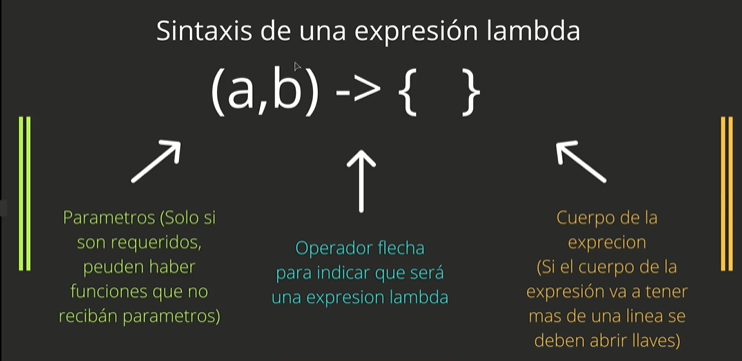
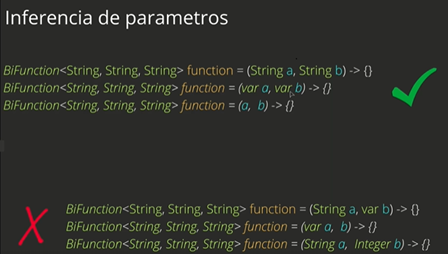

## _Lambdas_

## Definición:

_Es una subrutina definida que no está enlazada a un indicador._
_Son la implementación de una interface funcional mediante una clase anónima con la siguiente sintaxis:_
```java
(x, y) -> return x + y;
```




