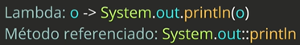
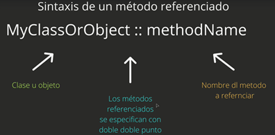
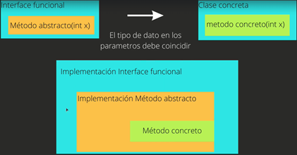
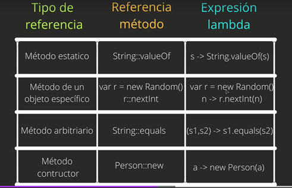

## _Referencia a métodos_

### Definición:

* Funcionalidad que puede sustituir a una expresión lambda cuya unica instrucción consiste en la llamada aún método.
* El compilador infiere las variables dadas por parametro en el argumento del método.

